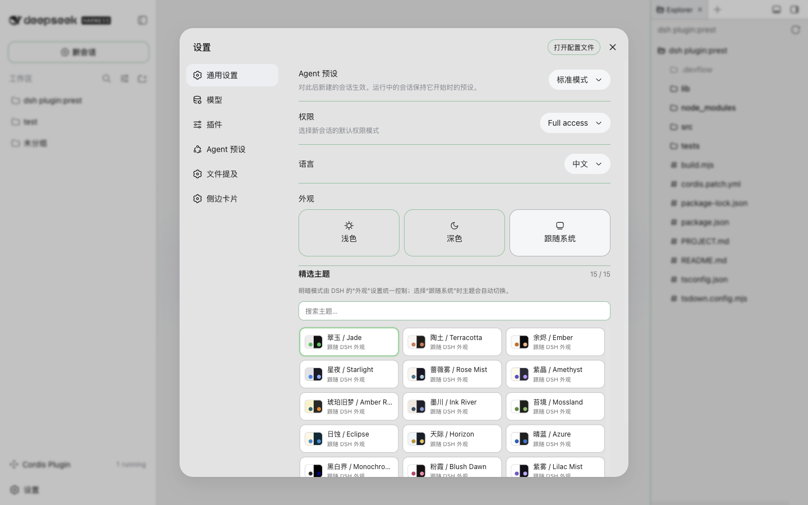
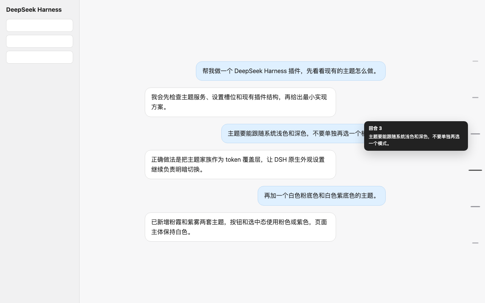

# dsh-plugins 中文说明

这是一个用于 [DeepSeek Harness](https://github.com/deepseek-ai/deepseek-harness) 的插件集合仓库。仓库采用 monorepo 结构，每个插件放在 `packages/` 下的独立目录里，互不影响。

## 当前插件

| 插件 | 功能 |
|---|---|
| [`dsh-theme-gallery`](packages/theme-gallery) | 提供 15 个精选主题家族，跟随 DSH 原生“浅色 / 深色 / 跟随系统”外观设置。 |
| [`dsh-skin-gallery`](packages/skin-gallery) | 独立承载 9 个完整 dsh-web-ui 皮肤复刻，避免主题设置页加载大体积皮肤资源。 |
| [`dsh-turn-scrubber`](packages/turn-scrubber) | 在对话右侧显示回合刻度，悬停展开，点击跳转到对应用户回合。 |
| [`dsh-pet-bridge`](packages/pet-bridge) | 桌面宠物状态桥：把 dsh 会话状态（思考中 / 读取文件 / 运行命令 / 完成）实时推送到 [cc-pet](https://github.com/wsxwj123/cc-pet) 桌面宠物气泡。 |
| [`dsh-session-manager`](packages/dsh-session-manager) | 会话删除（5 秒可撤销 + 回收站式硬删）与归档视图（查看/取消归档）。 |
| [`dsh-composer-tools`](packages/dsh-composer-tools) | 输入体验增强：方向键输入历史（首/末行门槛）+ 指令查看/编辑面板（全局+项目 AGENTS.md/CLAUDE.md）+ 提示词库（780 条，发送到输入框/复制）。 |

## 界面预览

### 主题画廊

真实运行界面：



### 对话回合刻度

悬停时会显示对应回合摘要，点击刻度可跳转：



## 仓库结构

```text
packages/
  theme-gallery/        # 主题画廊插件
  turn-scrubber/        # 对话回合刻度插件
  pet-bridge/           # 桌面宠物状态桥插件（配合 cc-pet 使用）
  dsh-session-manager/  # 会话删除 + 归档视图插件
  dsh-composer-tools/   # 输入体验增强（方向键历史/指令面板/提示词库）
```

每个插件都有自己的：

- 源码；
- 构建产物；
- `package.json`；
- `cordis.patch.yml`；
- README；
- 更新日志。

以后新增插件时，在 `packages/` 下新建独立目录，不把不同插件混在一个包里。

## 安装插件

先克隆仓库：

```bash
git clone https://github.com/wsxwj123/dsh-plugins
cd dsh-plugins
```

然后按需要安装某个插件。

### 安装主题画廊

```bash
dsh plugin --profile web add "link:$PWD/packages/theme-gallery"
```

### 安装回合刻度

```bash
dsh plugin --profile web add "link:$PWD/packages/turn-scrubber"
```

### 安装桌面宠物状态桥（需要先装 cc-pet）

```bash
dsh plugin --profile web add "link:$PWD/packages/pet-bridge"
```

> 前置条件：本机需已安装 [cc-pet](https://github.com/wsxwj123/cc-pet) 桌面宠物（它监听 `127.0.0.1:7779` 接收状态推送）。pet 端代码无需任何修改。详见 [packages/pet-bridge/README.md](packages/pet-bridge/README.md)。

### 安装会话管理

```bash
dsh plugin --profile web add "link:$PWD/packages/dsh-session-manager"
```

安装完成后，重启当前 `dsh web` 进程，并刷新已有页面地址。不要另起第二个 Web 服务。

> 安装后请检查 `~/.dsh/profiles/web/node_modules/@deepseek-ai` 是否被创建成真实目录。若是，应按 DSH 本机规则处理，避免 Cordis / Tool Symbol 分裂。相关背景见 [deepseek-harness discussion #783](https://github.com/deepseek-ai/deepseek-harness/discussions/783)。

### 安装输入体验增强（方向键历史/指令面板/提示词库）

```bash
dsh plugin --profile web add "link:$PWD/packages/dsh-composer-tools"
```

同样先 `cd packages/dsh-composer-tools && pnpm install && pnpm build`（lib/ 不入库），装完重启 `dsh web`，并执行上面的 `@deepseek-ai` 物理复制检查。

## 提交到 DSH Plugins 目录

[dshplugins.com](https://dshplugins.com/) 是独立的社区插件目录，不是 DeepSeek 官方站点。它的收录规则是：

1. 仓库必须是公开 GitHub 仓库；
2. 提交后进入人工审核队列；
3. 审核者会检查名称、摘要、安装类型、目标 profile、README 和安装命令；
4. 通过后才公开显示；
5. 收录不等于安全背书，用户仍应阅读源码后安装。

本仓库目前适合按“Local checkout”类型提交，目标 profile 为 `web`。提交入口是：

[Submit to DSH Plugins](https://dshplugins.com/submit)

提交页面要求登录。先使用仓库根 URL 做 repository inspect，再选择安装类型并填写简短摘要。建议分别提交多个插件时，使用各自独立 README 的安装路径说明，避免用户把整个 monorepo 误当成单个插件。

## 本地构建

```bash
pnpm build
pnpm check
```

仓库中的 DSH 运行时包被声明为可选 peer dependency，避免把第二份 DSH/Cordis 打进插件包，减少运行时符号不一致的问题。

## 主题画廊简介

主题画廊当前提供 15 个主题家族：

- 翠玉 / Jade
- 陶土 / Terracotta
- 余烬 / Ember
- 星夜 / Starlight
- 蔷薇雾 / Rose Mist
- 紫晶 / Amethyst
- 琥珀旧梦 / Amber Retro
- 墨川 / Ink River
- 苔境 / Mossland
- 日蚀 / Eclipse
- 天际 / Horizon
- 晴蓝 / Azure
- 黑白界 / Monochrome
- 粉霞 / Blush Dawn
- 紫雾 / Lilac Mist

插件只负责选择主题家族。浅色、深色和跟随系统仍由 DSH 自带的“外观”设置控制，两者不会互相覆盖。

### 自定义主题（CSS-only JSON 导入）

主题画廊支持导入自定义主题。自定义主题只做 CSS 变量注入，**不执行任何 JS**。JSON 形状：

```json
{
  "id": "my-jade-tweak",
  "label": "我的主题",
  "tokens": {
    "--dsw-alias-bg-base": { "light": "#fff", "dark": "#111" },
    "--dsw-alias-brand-primary": { "light": "#07c160", "dark": "#07c160" }
  }
}
```

必须含 `id`、`label`、非空 `tokens`；每个 token 名必须以 `--dsw-` 开头，值是 `{ "light": 字符串, "dark": 字符串 }`。导入后支持**试穿 / 应用 / 删除 / 恢复默认**。非法导入一律不改当前外观，并抛出带 `code` 的错误（见下文错误表）。

## 完整皮肤自定义（skin-gallery）

`dsh-skin-gallery` 内置 9 款完整皮肤复刻，每款支持**试穿**与**应用**，删除/恢复默认后回到 `none`。皮肤包为**受控导入**格式，三文件平铺：

```text
my-skin/
├── skin.json      # 元数据（必含 id / name / author / license）
├── client.js      # 契约：注册 __ModuleLoader__.load 并导出 apply(ctx)
└── a11y.css       # 可选；缺失则降级（皮肤仍可用，仅无对比修正）
```

- `skin.json` 缺 `id / name / author / license` 任一拒绝（**author 与 license 必填**，尊重 BSD-3 保留要求）。
- `client.js` 必须 `window.__ModuleLoader__.load({ id, factory })`、factory 导出 `apply(ctx)`，且 `apply` 只消费 `ctx.effect` / `ctx.get`。
- **高危能力拒绝**：含 `eval(`、`new Function(`、`import(`、非内联 `require(`、`<script src=`、`fetch(`、`XMLHttpRequest(`、`WebSocket(`、`localStorage`/`sessionStorage` 直读写、`document.cookie`、`chrome.runtime` 任一的包拒绝导入。
- 单包（skin.json + client.js）UTF-8 安全的 base64 后 ≤ 256KB；自定义皮肤总数 ≤ 8 个。

导入后同样支持**试穿 / 应用 / 删除 / 恢复默认**。

## 状态机与主题↔皮肤互斥

主题与皮肤各维护独立状态机（内置 + 自定义轨共用）：

```text
none ──import──▶ registry(未选) ──preview──▶ preview ──apply──▶ applied
  ▲                  │                                               │
  └───restore_default┴──delete(registry 移出；若为 applied 回默认)───┘
```

- `preview`：仅运行时生效，刷新即丢，不写 `applied` 键。
- `applied`：写入 `applied` 键，页面加载时按轨恢复。
- 两包经共享键 `dsh-appearance-track-v1` **软互斥**（'theme' | 'skin' | ''）：同一时刻至多一个轨激活外观。

## 错误码

导入/操作失败统一抛 `{ code, message }`，且**不改当前外观、不写任何 storage 键**：

| code | 说明 |
|---|---|
| `ERR_IMPORT_INVALID_JSON` | 主题 / 皮肤 JSON 解析失败 |
| `ERR_THEME_MISSING_FIELD` | 主题缺 id/label/tokens 之一，或格式非法 |
| `ERR_THEME_BAD_TOKEN` | token 名非 `--dsw-` 前缀，或值非 {light,dark} 字符串 |
| `ERR_THEME_ID_CONFLICT` | 与内置主题 id 冲突 |
| `ERR_SKIN_MISSING_FILE` | 缺 skin.json / client.js |
| `ERR_SKIN_BAD_META` | skin.json 缺 id/name/author/license（author/license 必填） |
| `ERR_SKIN_CONTRACT` | client.js 不满足 __ModuleLoader__/apply/ctx.effect 契约 |
| `ERR_SKIN_DANGEROUS` | client.js 含高危能力（eval/fetch/…） |
| `ERR_SKIN_SIZE` | 单包 base64 后超 256KB |
| `ERR_SKIN_COUNT` | 自定义皮肤超 8 个 |
| `ERR_UNKNOWN_ID` | 试穿/应用不存在的自定义 id |
| `ERR_A11Y_MISSING` | a11y.css 缺失（非致命，仅日志，皮肤仍可用） |

## 许可证

MIT
