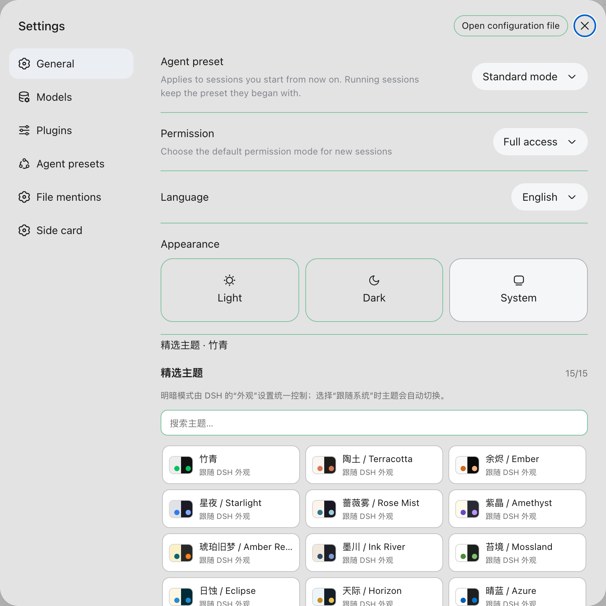
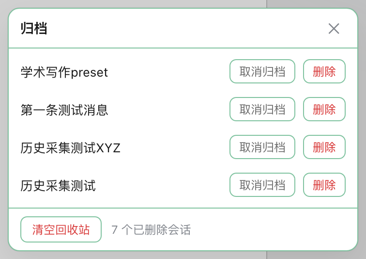
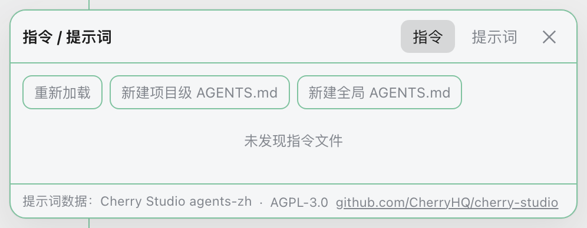

# dsh-plugins 中文说明

这是一个用于 [DeepSeek Harness](https://github.com/deepseek-ai/deepseek-harness) 的插件集合仓库。仓库采用 monorepo 结构，每个插件放在 `packages/` 下的独立目录里，互不影响。

English: [README.en.md](README.en.md)

## 当前插件

| 插件 | 功能 |
|---|---|
| [`dsh-appearance-gallery`](packages/dsh-appearance-gallery) | 外观画廊：15 个主题家族 + 9 个 dsh-web-ui 皮肤复刻（复刻程度不一，详见下文），合并为单一插件、设置页单一入口，支持自定义主题 JSON 与自定义皮肤包导入。 |
| [`dsh-turn-scrubber`](packages/dsh-turn-scrubber) | 在对话右侧显示回合刻度，悬停展开，点击跳转到对应用户回合。 |
| [`dsh-pet-bridge`](packages/dsh-pet-bridge) | 桌面宠物状态桥：把 dsh 会话状态（思考中 / 读取文件 / 运行命令 / 完成）实时推送到 [cc-pet](https://github.com/wsxwj123/cc-pet) 桌面宠物气泡。 |
| [`dsh-session-manager`](packages/dsh-session-manager) | 会话删除（5 秒可撤销 + 回收站式硬删）与归档视图（查看/取消归档）。 |
| [`dsh-composer-tools`](packages/dsh-composer-tools) | 输入体验增强：方向键输入历史（首/末行门槛）+ 指令查看/编辑面板（全局+项目 AGENTS.md/CLAUDE.md）+ 提示词库（780 条，发送到输入框/复制）。 |

所有插件在 macOS 与 Windows 上均可使用。

## 界面预览

### 外观画廊（主题 + 皮肤）



### 会话管理（归档 + 回收站）



### 输入体验增强（指令面板 + 提示词库）



### 对话回合刻度


## 从旧版本升级（装过主题画廊 / 皮肤画廊的看这里）

`dsh-theme-gallery`、`dsh-skin-gallery`、`dsh-skin-runtime` 三个插件已合并为 `dsh-appearance-gallery`，原目录不再存在。已安装旧插件的用户需要卸旧装新，否则 `dsh web` 启动时会因插件目录消失而报 loader 错误。

**macOS / Linux：**

```bash
dsh plugin --profile web remove dsh-theme-gallery dsh-skin-gallery dsh-skin-runtime
dsh plugin --profile web add "link:$PWD/packages/dsh-appearance-gallery"
```

**Windows（PowerShell）：**

```powershell
dsh plugin --profile web remove dsh-theme-gallery dsh-skin-gallery dsh-skin-runtime
dsh plugin --profile web add "link:$PWD\packages\dsh-appearance-gallery"
```

换装后重启 `dsh web` 并刷新页面。**你的外观设置不会丢**：主题与皮肤的状态键完全沿用旧键，已应用的主题/皮肤、已导入的自定义主题与自定义皮肤在升级后原样保留，无需重新导入。

## 安装插件

### 方式一：从 npm 安装（推荐）

无需克隆仓库，装的是预构建产物，跳过本地构建步骤：

```bash
dsh plugin --profile web add dsh-appearance-gallery
dsh plugin --profile web add dsh-turn-scrubber
dsh plugin --profile web add dsh-composer-tools
dsh plugin --profile web add @wsxwj123/dsh-session-manager
```

> `dsh-session-manager` 这个扁平包名在 npm 上已被他人占用，本插件发布为作用域包 `@wsxwj123/dsh-session-manager`，功能与仓库内的 `packages/dsh-session-manager` 完全一致。

安装 `dsh-pet-bridge` 前需先安装 [cc-pet](https://github.com/wsxwj123/cc-pet) 桌面宠物（它监听 `127.0.0.1:7779` 接收状态推送，pet 端代码无需修改）：

```bash
dsh plugin --profile web add dsh-pet-bridge
```

npm 包一览：

| 插件 | npm 包名 |
|---|---|
| 外观画廊 | [`dsh-appearance-gallery`](https://www.npmjs.com/package/dsh-appearance-gallery) |
| 回合刻度 | [`dsh-turn-scrubber`](https://www.npmjs.com/package/dsh-turn-scrubber) |
| 输入体验增强 | [`dsh-composer-tools`](https://www.npmjs.com/package/dsh-composer-tools) |
| 会话管理 | [`@wsxwj123/dsh-session-manager`](https://www.npmjs.com/package/@wsxwj123/dsh-session-manager) |
| 桌面宠物状态桥 | [`dsh-pet-bridge`](https://www.npmjs.com/package/dsh-pet-bridge) |

### 方式二：从源码安装

先克隆仓库：

```bash
git clone https://github.com/wsxwj123/dsh-plugins
cd dsh-plugins
```

然后按需要安装某个插件（把目录名换成上表里的插件名即可）：

```bash
dsh plugin --profile web add "link:$PWD/packages/dsh-appearance-gallery"
```

Windows（PowerShell）下把路径分隔符换成反斜杠：

```powershell
dsh plugin --profile web add "link:$PWD\packages\dsh-appearance-gallery"
```

`dsh-composer-tools` 从源码安装时需要先在包目录内 `pnpm install && pnpm build`（`lib/` 不入库）；从 npm 安装则无需此步。

### 两种方式都适用

安装完成后，重启当前 `dsh web` 进程，并刷新已有页面地址。不要另起第二个 Web 服务。

> 安装后请检查 `~/.dsh/profiles/web/node_modules/@deepseek-ai` 是否被创建成真实目录。**正常情况下它不应存在**——出现真实目录意味着 profile 里多了一份框架副本，会导致 Cordis / Tool Symbol 分裂（工具调用报 `Cannot read properties of undefined`）。相关背景见 [deepseek-harness discussion #783](https://github.com/deepseek-ai/deepseek-harness/discussions/783)。本仓库所有插件的框架包 peer 范围都显式匹配宿主版本（如 `^0.1.0-rc.6`、cordis `^4.0.1`）。注意通配符 `"*"` 在 semver 下匹配不到 `0.1.0-rc.6` 这类预发布版本，反而会让 peer 永远不满足。

## 仓库结构

```text
packages/
  dsh-appearance-gallery/  # 外观画廊（主题 + 皮肤，含 9 套皮肤资源）
  dsh-turn-scrubber/       # 对话回合刻度
  dsh-pet-bridge/          # 桌面宠物状态桥（配合 cc-pet 使用）
  dsh-session-manager/     # 会话删除 + 归档视图
  dsh-composer-tools/      # 输入体验增强（方向键历史/指令面板/提示词库）
```

每个插件都有自己的源码、构建产物、`package.json`、`cordis.patch.yml`、README 和更新日志。新增插件时在 `packages/` 下新建独立目录，不把不同插件混在一个包里。

## 本地构建

```bash
pnpm build
pnpm check
```

仓库中的 DSH 运行时包被声明为可选 peer dependency，避免把第二份 DSH/Cordis 打进插件包。

`dsh-appearance-gallery` 的 `lib/client.js` 由 `build.mjs` 生成，**不可手工编辑**：DSH 要求 bundle 执行后自行调用 `window.__ModuleLoader__.load(...)` 注册，这层注册壳只存在于构建产物中。`node build.mjs --check` 会校验产物的注册壳、体积上限与皮肤资源完整性，是只读检查，可放进 CI。

## 外观画廊

### 主题

提供 15 个主题家族：翠玉、陶土、余烬、星夜、蔷薇雾、紫晶、琥珀旧梦、墨川、苔境、日蚀、天际、晴蓝、黑白界、粉霞、紫雾。

插件只负责选择主题家族，浅色 / 深色 / 跟随系统仍由 DSH 自带的"外观"设置控制，两者不会互相覆盖。

### 皮肤

内置 9 款 dsh-web-ui 皮肤复刻，每款支持试穿与应用。**各款复刻程度不同**：

| 复刻程度 | 皮肤 |
|---|---|
| 完整界面复刻（含控件、标题栏等细节） | 初音未来、同花顺、QQ2008 怀旧版、Windows XP |
| 较完整 | Minecraft |
| 以配色为主（界面结构基本保持 DSH 原样） | 交易终端、蓝色幻想、龙的传人、鲸吟 |

复刻程度沿用上游 dsh-web-ui 原包，本插件未做增删。若期待"换个皮肤界面完全变样"，请优先选前四款。

### 自定义主题（CSS-only JSON 导入）

自定义主题只做 CSS 变量注入，**不执行任何 JS**。JSON 形状：

```json
{
  "id": "my-jade-tweak",
  "label": "我的主题",
  "tokens": {
    "--dsw-alias-bg-base": { "light": "#fff", "dark": "#111" },
    "--dsw-alias-brand-primary": { "light": "#07c160", "dark": "#07c160" }
  }
}
```

必须含 `id`、`label`、非空 `tokens`；每个 token 名必须以 `--dsw-` 开头，值是 `{ "light": 字符串, "dark": 字符串 }`。导入后支持试穿 / 应用 / 删除 / 恢复默认。非法导入一律不改当前外观，并抛出带 `code` 的错误（见下文错误表）。

### 自定义皮肤（三文件受控导入）

```text
my-skin/
├── skin.json      # 元数据（必含 id / name / author / license）
├── client.js      # 契约：注册 __ModuleLoader__.load 并导出 apply(ctx)
└── a11y.css       # 可选；缺失则降级（皮肤仍可用，仅无对比修正）
```

- `skin.json` 缺 `id / name / author / license` 任一拒绝（author 与 license 必填，尊重 BSD-3 保留要求）；声明 `bodyAttr` 时必须匹配 `/^data-[a-z0-9-]{1,64}$/`。
- `client.js` 必须 `window.__ModuleLoader__.load({ id, factory })`、factory 导出 `apply(ctx)`，且 `apply` 只消费 `ctx.effect` / `ctx.get`。
- **高危能力拒绝**：含 `eval(`、`new Function(`、`import(`、非内联 `require(`、`<script src=`、`fetch(`、`XMLHttpRequest(`、`WebSocket(`、`localStorage`/`sessionStorage` 直读写、`document.cookie`、`chrome.runtime` 任一的包拒绝导入。
- `a11y.css` 只允许 `data:` 与相对路径的 `url()`，`http` / `//` / `file:` / `ftp` / `ws` 一律拒绝（防止皮肤包向外部发起请求）。
- 单包（skin.json + client.js）UTF-8 安全的 base64 后 ≤ 256KB；自定义皮肤总数 ≤ 8 个。

## 状态机与主题↔皮肤互斥

主题与皮肤各维护独立状态机（内置 + 自定义轨共用）：

```text
none ──import──▶ registry(未选) ──preview──▶ preview ──apply──▶ applied
  ▲                  │                                               │
  └───restore_default┴──delete(registry 移出；若为 applied 回默认)───┘
```

- `preview`：仅运行时生效，刷新即丢，不写 `applied` 键。
- `applied`：写入 `applied` 键，页面加载时按轨恢复。
- 两轨经共享键 `dsh-appearance-track-v1` **软互斥**（'theme' | 'skin' | ''）：同一时刻至多一个轨激活外观。

## 错误码

导入/操作失败统一抛 `{ code, message }`，且**不改当前外观、不写任何 storage 键**：

| code | 说明 |
|---|---|
| `ERR_IMPORT_INVALID_JSON` | 主题 / 皮肤 JSON 解析失败 |
| `ERR_THEME_MISSING_FIELD` | 主题缺 id/label/tokens 之一，或格式非法 |
| `ERR_THEME_BAD_TOKEN` | token 名非 `--dsw-` 前缀，或值非 {light,dark} 字符串 |
| `ERR_THEME_ID_CONFLICT` | 与内置主题 id 冲突 |
| `ERR_SKIN_MISSING_FILE` | 缺 skin.json / client.js |
| `ERR_SKIN_BAD_META` | skin.json 缺 id/name/author/license，或 bodyAttr 格式非法 |
| `ERR_SKIN_CONTRACT` | client.js 不满足 __ModuleLoader__/apply/ctx.effect 契约 |
| `ERR_SKIN_DANGEROUS` | client.js 含高危能力（eval/fetch/…），或 a11y.css 含外部 url() |
| `ERR_SKIN_SIZE` | 单包 base64 后超 256KB |
| `ERR_SKIN_COUNT` | 自定义皮肤超 8 个 |
| `ERR_UNKNOWN_ID` | 试穿/应用不存在的自定义 id |
| `ERR_A11Y_MISSING` | a11y.css 缺失（非致命，仅日志，皮肤仍可用） |

## 提交到 DSH Plugins 目录

[dshplugins.com](https://dshplugins.com/) 是独立的社区插件目录，不是 DeepSeek 官方站点。仓库必须公开，提交后进入人工审核队列，审核者会检查名称、摘要、安装类型、目标 profile、README 和安装命令。收录不等于安全背书，用户仍应阅读源码后安装。

本仓库适合按"Local checkout"类型提交，目标 profile 为 `web`。分别提交多个插件时，使用各自独立 README 的安装路径说明，避免用户把整个 monorepo 误当成单个插件。

## 许可证

MIT
